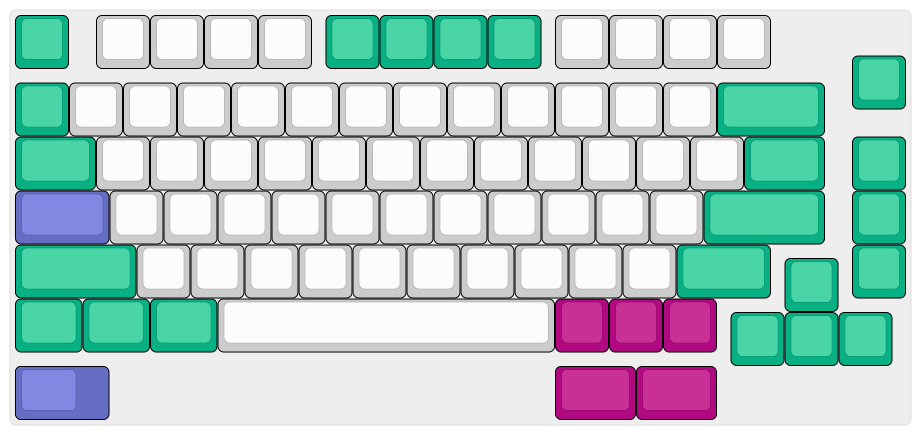

# Satisfaction75 R1/R2 Plate CAD Files

**NOTE**: This is still a work-in-progress; this note will be removed once it's ready!

This repository contains custom CAD files for the [Satisfaction75 R1/R2](https://cannonkeys.com/collections/satisfaction-75)'s keyboard plate. They are derived from the [official plate files](https://geekhack.org/index.php?topic=100419.msg2769155#msg2769155) provided by CannonKeys.

## [`S75_ANSI_625_WK_BKSP`](./custom/S75_ANSI_625_WK_BKSP/)

- ANSI Layout
- 6.25u Spacebar w/ Universal Bottom Row
- No Split Backspace
- No Stepped Caps Lock
- Supports Plate Mounted Stabilizers

## License

All files in the [`official`](./official/) have been taken from the original GeekHack post, and I believe they are in the public domain (could not find a license). Please contact me if this is incorrect.

All other design files hosted in this repository are licensed under the [CERN-OHL-W-2.0 license](./LICENSE).
