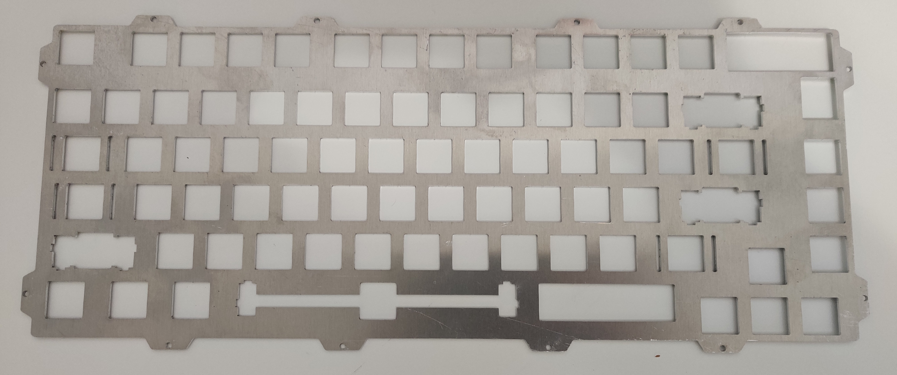
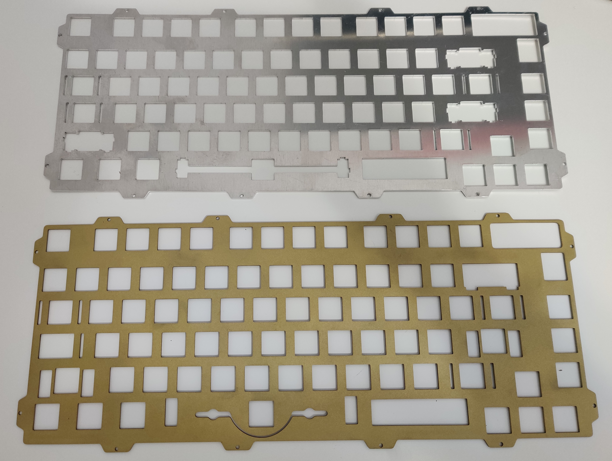

# `S75_ANSI_625_WK_BKSP`

## Features

- ANSI Layout
- 6.25u Spacebar w/ Universal Bottom Row
- No Split Backspace
- No Stepped Caps Lock
- Supports Plate Mounted Stabilizers

## Rendered 3D Model

## 1.5mm Aluminium 5251

Not the prettiest (I got this laser cut fairly cheaply), but it works quite well, and the visual defects are hidden in actual use:

## Comparison Against Stock Plate (6.25u Spacebar)

